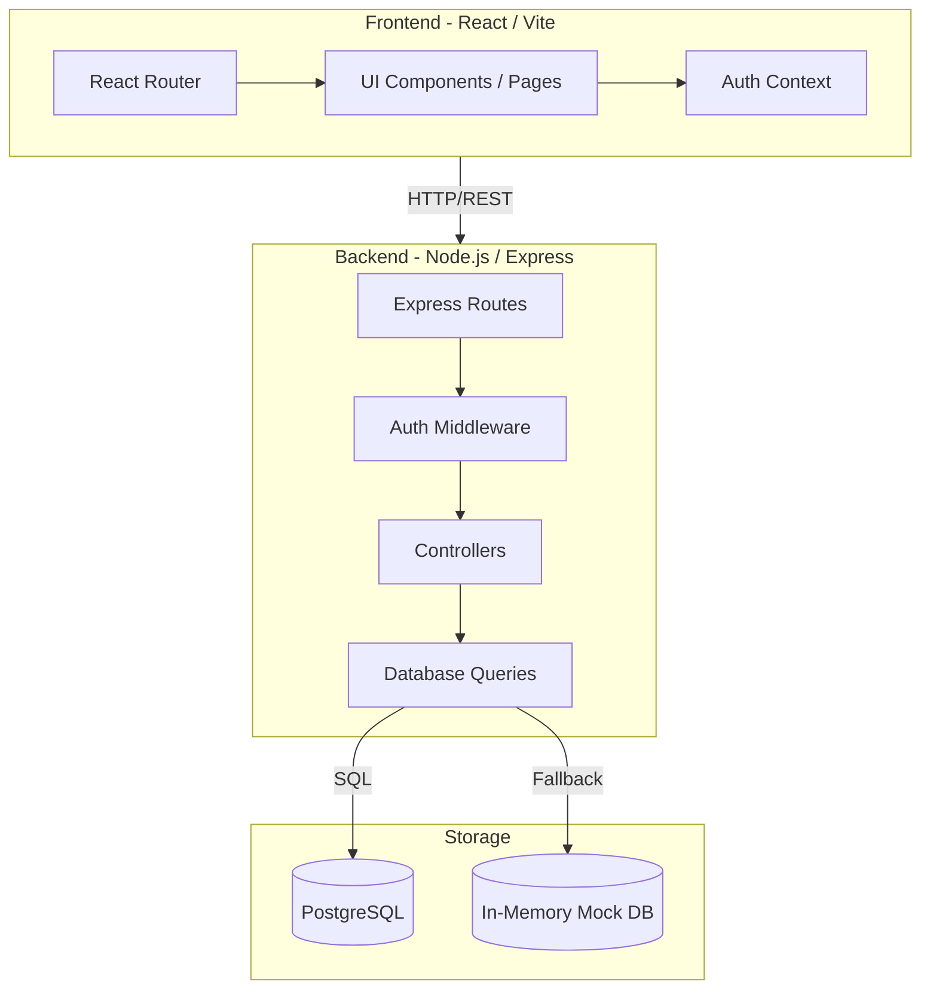
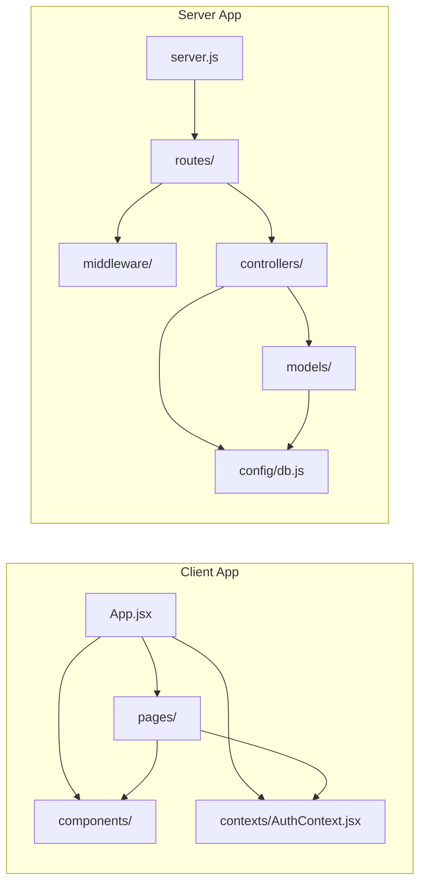
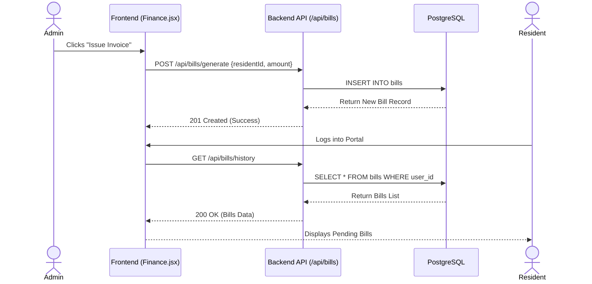
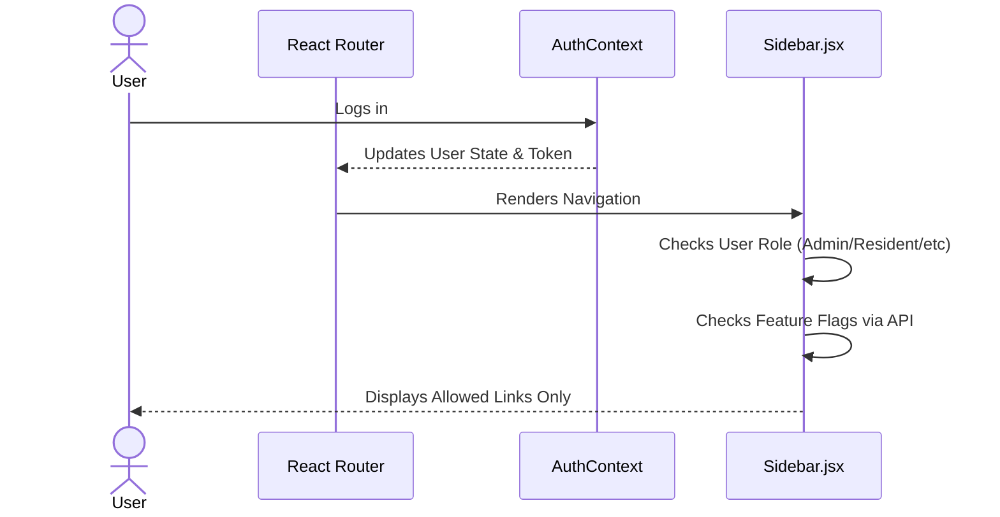

# Architecture Map - Maa Kaushalya Apartment Management System

Welcome to the Living Documentation for the Maa Kaushalya Apartment Management System. This document serves as the single source of truth for our system architecture, component dependencies, and data flows. 

## 1. High-Level Architecture

The system follows a standard modern web architecture with a decoupled frontend and backend.

- **Frontend (Client):** Single Page Application (SPA) built with React 18, Vite, and Tailwind CSS.
- **Backend (Server):** RESTful API built with Node.js and Express.
- **Database:** PostgreSQL for persistent storage, with a fallback in-memory mock database mode for local development/offline use.
- **Authentication:** JWT (JSON Web Tokens) based authentication with Role-Based Access Control (RBAC). Roles include Admin, Committee, Security, and Resident.

### Component Diagram



## 2. Code-Level Dependencies

This section visualizes the internal coupling of the system's directories and key files. 

### Dependency Graph



## 3. Data Flow Sequences

### Feature: Maintenance Bill Generation & Payment



### Feature: RBAC Protected Navigation



## 4. Maintenance Strategy & Living Documentation

To ensure this document remains a true reflection of the codebase ("Architecture-as-Code"), follow this maintenance strategy:

### A. Antigravity IDE Integration
Antigravity IDE natively supports viewing Mermaid diagrams within Markdown files. You do not need to install any additional extensions. 
- Simply open this `ARCHITECTURE.md` file in Antigravity.
- When viewing the markdown, Antigravity's built-in markdown preview will automatically render the `mermaid` code blocks into beautiful diagrams.

### B. Automated Dependency Scanning (Future Enhancement)
To automate the generation of dependency graphs, you can integrate a tool like `madge` (for JavaScript/Node.js dependencies) into your CI/CD pipeline or as a pre-commit hook.

**Setup `madge`:**
```bash
npm install -g madge
```

**Generate an updated graph:**
```bash
npx madge --image deps.png client/src/App.jsx
```
*Note: `madge` can also output JSON or raw data which can be parsed into Mermaid syntax via custom scripts if you want fully automated markdown updates.*

### C. Pre-commit Hook Strategy
You can set up Husky to enforce documentation checks:

1. Install Husky in your repository root: `npm install husky --save-dev`
2. Initialize Husky: `npx husky install`
3. Add a `pre-commit` script that reminds developers to update `ARCHITECTURE.md` if key structural folders (`routes/`, `controllers/`, `pages/`) are modified.

**Example Git Hook (`.husky/pre-commit`):**
```bash
#!/bin/sh
. "$(dirname "$0")/_/husky.sh"

# Check if structural files have been staged
if git diff --cached --name-only | grep -E "^(server/routes/|server/controllers/|client/src/pages/|client/src/components/)"; then
  echo -e "\033[33mWARNING: Structural changes detected.\033[0m"
  echo "Did you update ARCHITECTURE.md?"
  
  # Optional: Wait for user confirmation before allowing commit
  # exec < /dev/tty
  # read -p "Press Y to continue commit, or Ctrl+C to abort: " -n 1 -r
  # echo
  # if [[ ! $REPLY =~ ^[Yy]$ ]]
  # then
  #   exit 1
  # fi
fi
```
